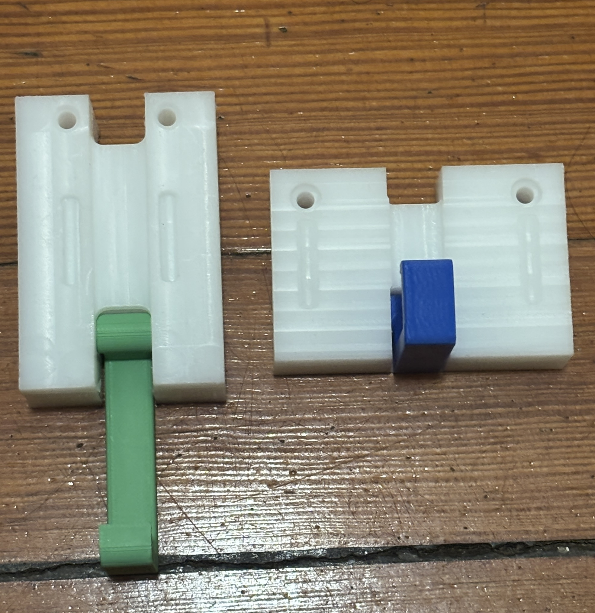
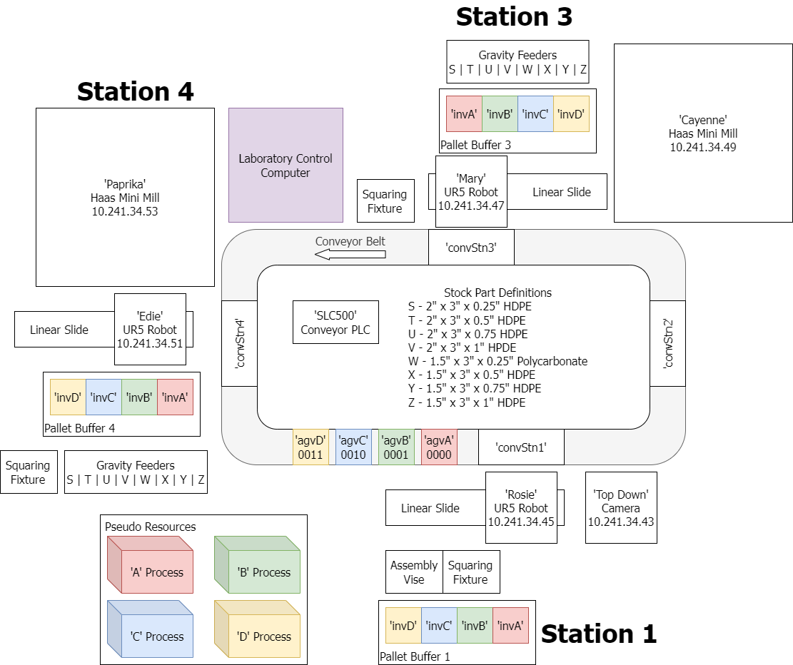
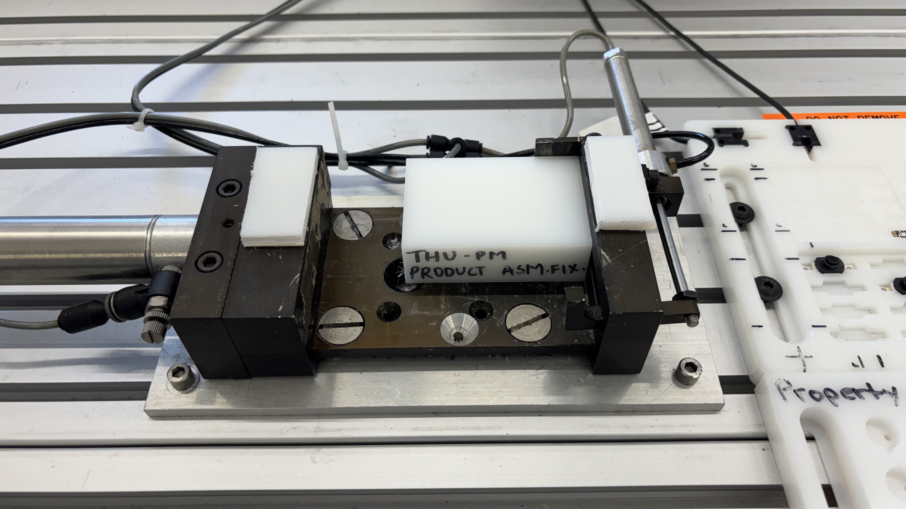
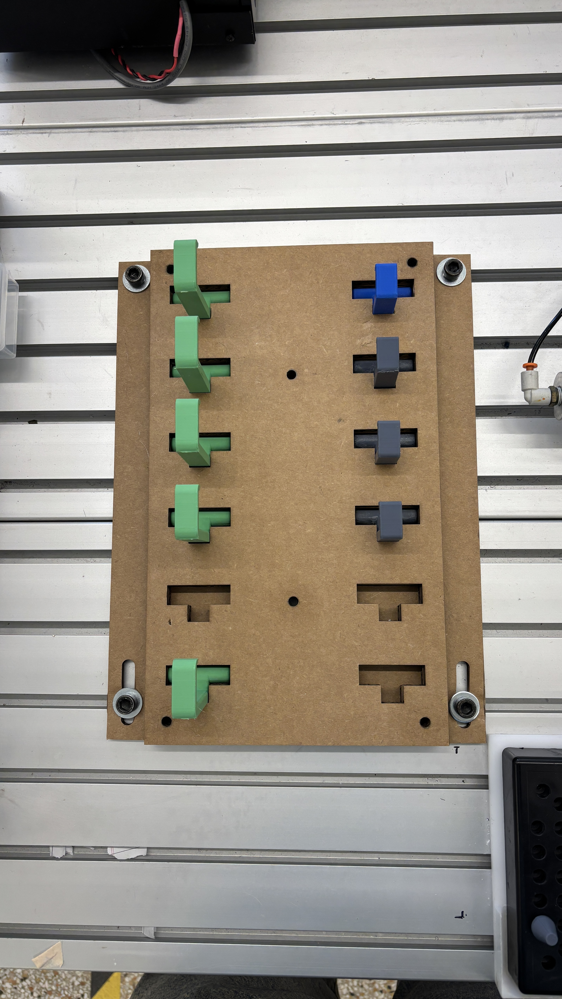
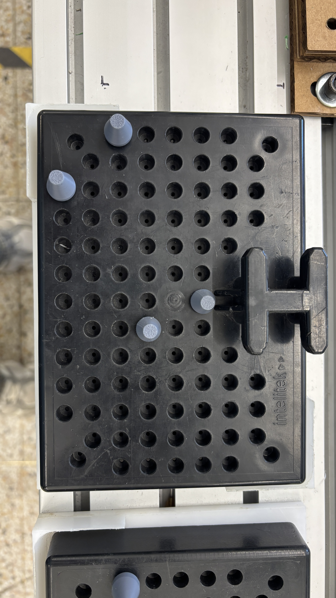
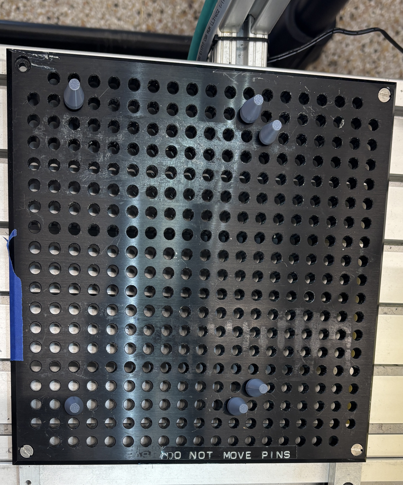

# ME500 Variable Product Manufacturing — Thursday PM Lab Group

**Course:** ME500: Advanced Manufacturing — Spring 2026  
**Team:** Chris Daub, Riley Hubscher, Mukhamed Kerimkul, Bramasto Prasojo, and Chaitanya Sai Nikith Rambha  
**Institution:** Advanced Design and Manufacturing Lab (ADML)

---

## Project Overview

This project implements a **Variable Product Manufacturing (VPM)** system in the ADML. The system autonomously produces two variants of a swivel hook product — **Short Hook (Product A)** and **Tall Hook (Product B)** — each consisting of a CNC-machined lid, a CNC-machined base, and a 3D-printed hook. A computer vision system identifies the lid type and directs the correct assembly procedure.

The system integrates three UR5 robots (Rosie, Mary, Edie), two Haas Mini Mills (Cayenne, Paprika), a conveyor belt, an Allen-Bradley SLC500 PLC, and a top-down webcam — all orchestrated by BUMES (Boston University Manufacturing Execution System).

---

## Products


*Left: Tall Hook (Product B) — Right: Short Hook (Product B)*

Each product consists of:
- A CNC-machined HDPE **lid** (Haas Mini Mill)
- A CNC-machined HDPE **base** (Haas Mini Mill)
- A 3D-printed PLA **hook** (Bambu Labs, ~20 min print time)

---

## Lab Layout


*ADML Flexible Manufacturing Cell — Stations 1, 3, and 4*

| Station | Robot | Mill | Key Resources |
|---------|-------|------|---------------|
| Station 1 | Rosie (10.241.34.45) | — | Assembly Vise, Squaring Fixture, Top-Down Camera (10.241.34.43), Pallet Buffer 1 |
| Station 3 | Mary (10.241.34.47) | Cayenne (10.241.34.49) | Squaring Fixture, Pallet Buffer 3 |
| Station 4 | Edie (10.241.34.51) | Paprika (10.241.34.53) | Squaring Fixture, Pallet Buffer 4 |

AGVs (`agvA`–`agvD`) transport pallets between stations via the conveyor belt, controlled by the `SLC500` Conveyor PLC.

---

## Supporting Hardware

### Assembly Fixture

*THU-PM Product Assembly Fixture at Station 1 — used by Rosie to assemble lid, base, and hook*

### Hook Tray

*Laser-cut cardboard hook inventory tray — holds Short (green) and Tall (blue/grey) hooks*

### Pallet Peg Locations

*3D-printed grey pegs on inventory pallet — replace reflective metal pegs that interfered with computer vision*

### Camera Scan Peg Location

*Peg configuration on the camera scan station — used during vision system lid classification*

---

## Repository Structure

```
Variable-Product-Manufacturing/
│
├── BUMES/
│   ├── Assembly.txt
│   ├── ShortLid.txt           # BUMES script: Short Lid (Stations 3→1)
│   ├── ShortBody.txt          # BUMES script: Short Body + Assembly (Stations 4→1)
│   ├── TallLid.txt            # BUMES script: Tall Lid (Stations 3→1)
│   └── TallBody.txt           # BUMES script: Tall Body + Assembly (Stations 4→1)
│
├── CAD:CAM Files/
│   ├── AssemblyA2.SLDASM      # SolidWorks assembly: Product A
│   ├── AssemblyB2.SLDASM      # SolidWorks assembly: Product B
│   ├── Assembly1.zip          # Fusion 360 CAM: Product A
│   ├── Assembly1V.zip         # Fusion 360 CAM: Product B
│   ├── AssemblyA Step/        # STEP files: Base1, Lid1, Hook1
│   ├── AssemblyB step/        # STEP files: Base1V, Lid1V, Hook1V
│   ├── Base1.SLDPRT           # SolidWorks: Short base
│   ├── Base1V.SLDPRT          # SolidWorks: Tall base
│   ├── Lid 1.SLDPRT           # SolidWorks: Short lid
│   ├── Lid1V.SLDPRT           # SolidWorks: Tall lid
│   ├── Hook1.SLDPRT           # SolidWorks: Short hook
│   ├── Hook1V.SLDPRT          # SolidWorks: Tall hook
│   ├── Base1CNC_1.png         # CAM setup screenshot: Short base
│   ├── Base1VCNC_1.png        # CAM setup screenshot: Tall base
│   ├── Lid1CNC_1.png          # CAM setup screenshot: Short lid
│   ├── Lid1VCNC_1.png         # CAM setup screenshot: Tall lid
│   ├── Hook 3d Print/
│   │   ├── Hook1.STL          # STL: Short hook
│   │   └── Hook1V.STL         # STL: Tall hook
│   └── NC Programs/
│       ├── ThPmLidA_1.nc      # G-code: Short Lid (O01021)
│       ├── ThPmBaseA_1.nc     # G-code: Short Base (O01011)
│       ├── ThPmLidB_1.nc      # G-code: Tall Lid (O02021)
│       └── ThPmBaseB_1.nc     # G-code: Tall Base (O02011)
│
├── Documentation/
│   ├── BUMES Operation Guide.docx
│   ├── CAD_CAM Documentation.docx
│   ├── Integration & Vision Scripts.docx
│   └── URP Files.docx
│
├── Rosie/                     # UR5 Robot at Station 1
│   ├── _adminCG-*.urp/script/txt     # Pallet movement admin programs
│   ├── _adminLinearIndex*.urp        # Linear slide positioning
│   ├── Assembly_Vision.urp           # Conditional assembly based on vision result
│   ├── hookA_manager.urp             # Short hook pick logic
│   ├── hookB_manager.urp             # Tall hook pick logic
│   ├── Short_LidToCamera.urp         # Move short lid to camera + run vision
│   ├── Tall_LidToCamera.urp          # Move tall lid to camera + run vision
│   └── vision_pc_modbus.script       # Triggers vision.py and writes Modbus result
│
├── Mary/                      # UR5 Robot at Station 3
│   ├── _adminCG-*.urp/script/txt     # Pallet movement admin programs
│   ├── _adminLinearIndex5.urp        # Linear slide positioning
│   ├── gravityFeederT.urp            # Collect and square Stock T
│   ├── Short_StockT_LoadMill_MakePart_Tier1.urp
│   ├── Short_Lid_UnloadMill.urp
│   ├── Short_PHomeToInvA.urp
│   ├── Tall_StockT_LoadMill_MakePart_Tier3.urp
│   ├── Tall_Lid_UnloadMill.urp
│   └── Tall_PHomeToInvC.urp
│
├── Edie/                      # UR5 Robot at Station 4
│   ├── _adminCG-*.urp/script/txt     # Pallet movement admin programs
│   ├── _adminLinearIndex2.urp        # Linear slide positioning
│   ├── gravityFeederV.urp            # Collect and square Stock V
│   ├── Short_StockV_LoadMill_MakePart_Tier1.urp
│   ├── Short_Body_UnloadMill_Tier1.urp
│   ├── Short_PHomeToInvB.urp
│   ├── Tall_StockV_LoadMill_MakePart_Tier3.urp
│   ├── Tall_Body_UnloadMill_Tier3.urp
│   └── Tall_PHomeToInvD.urp
│
├── Vision/
│   ├── listener_server.py     # TCP server: receives trigger from Rosie
│   ├── listener_server_test.py
│   ├── modbus_server.py       # Modbus server: posts vision results to Rosie
│   ├── vision.py              # Core vision algorithm (lidTypeIndicator)
│   ├── vision_utils.py        # Shared utilities and RESULT_CODES
│   ├── vision_test.py         # Bulk and individual test harness
│   └── BulkTest/
│       ├── short1.png         # Sample short lid test image
│       └── tall1.png          # Sample tall lid test image
│
├── images/
│   ├── ADML_FMC.drawio.png
│   ├── Product_Tall_Short.JPG
│   ├── Assembly_fixture.JPG
│   ├── Hook_Tray.JPG
│   ├── Pallet_Peg_location.JPG
│   └── Cam_Scan_Peg_location.JPG
│
├── THU PM FINAL Project Update.pptx
└── README.md
```

---

## Vision System

The computer vision system runs on the Station 1 computer and classifies lids as **Short** or **Tall** using a webcam and OpenCV.

### Algorithm (in `vision.py`)

1. **Capture** — `scan()` connects to the webcam, buffers 30 frames, and captures an image
2. **Crop** — `clipBlacks()` thresholds near-white pixels; `findLargestConnected()` isolates the lid area; `crop()` extracts it
3. **Process** — `findHoles()` uses a blob detector (tuned for circularity, area) to locate the two through-holes; `calcHoleSpacing()` measures inter-hole distance
4. **Classify** — `lidTypeByHoles()` compares distance against threshold **85**:
   - Short lid: ~110px spacing
   - Tall lid: ~60px spacing
   - Threshold sits ~11 standard deviations from both means — effectively perfect accuracy

### Communication Flow
```
Rosie triggers lid scan
        ↓
listener_server.py (TCP port 30002, HOST=10.241.34.37)
        ↓
vision.py → lidTypeIndicator()
        ↓
modbus_server.py (port 502) writes result to register 0
        ↓
Rosie reads Modbus register → runs Assembly_Vision.urp
```

### Setup

Requires **Python 3.14.3**. Set up a virtual environment in VS Code to avoid conflicts with existing lab software.

```bash
pip install -r requirements.txt
```

Start the servers in two separate terminals **before** running BUMES:

```bash
python listener_server.py
python modbus_server.py
```

---

## BUMES Operation Guide

### Prerequisites

1. Turn on all machines: robots, CNC mills, conveyor belt, and master air supply
2. Connect the computer vision webcam to BUMES Computer 1 (Station 1)
3. Populate pallet inventory bays near Rosie with pallets set for **stock sizes T and V** using 3D-printed pegs
4. Press **"Run Program"** on each robot's touchscreen
5. Select **Program 9000** on each CNC mill; clear errors with Reset, then press "Power up/Restart"
6. Fill gravity feeders with **stocks T and V**
7. Initialize BUMES on BUMES Computer 1
8. Start the vision servers (see above)

### Running the System

Queue and run all four BUMES programs simultaneously:

| Script | Stations | Produces | Pallet | Stock |
|--------|----------|----------|--------|-------|
| ShortLid | 3 → 1 | Lid A (short) | invA / agvA | T (Tier 1) |
| ShortBody | 4 → 1 | Body A (short) + Assembly | invB / agvB | V (Tier 1) |
| TallLid | 3 → 1 | Lid B (tall) | invC / agvC | T (Tier 3) |
| TallBody | 4 → 1 | Body B (tall) + Assembly | invD / agvD | V (Tier 3) |

Assembly is triggered by **ShortBody** and **TallBody** after the vision system confirms the lid type. Rosie performs the final assembly and delivers the product to the output box.

---

## CNC Programs

| Program | File | Machine | Stock | Tier | Part |
|---------|------|---------|-------|------|------|
| O01021 | ThPmLidA_1.nc | Cayenne | T | 1 | Short Lid |
| O01011 | ThPmBaseA_1.nc | Paprika | V | 1 | Short Base |
| O02021 | ThPmLidB_1.nc | Cayenne | T | 3 | Tall Lid |
| O02011 | ThPmBaseB_1.nc | Paprika | V | 3 | Tall Base |

**WCS Origin:** Bottom, back, right corner of stock when facing the machine from the sliding door side.

**Tools used:** T1 ⅛" flat end mill, T2 ¼" flat end mill, T3 ⅜" flat end mill, T4 ½" flat end mill, T5 ¼" 90° spot drill, T6 3/16" drill

---

## 3D Print Settings (Hooks)

Printed on a **Bambu Labs** printer using **Bambu Studio** slicer, standard PLA, 0.2mm layer height:

| Setting | Value |
|---------|-------|
| Sparse Infill Density | 6% |
| Sparse Infill Pattern | Gyroid |
| Supports | Tree (auto) |

Print time: ~20 minutes per hook.

---

## Key Network Addresses

| Device | IP Address |
|--------|-----------|
| Rosie (UR5, Station 1) | 10.241.34.45 |
| Mary (UR5, Station 3) | 10.241.34.47 |
| Edie (UR5, Station 4) | 10.241.34.51 |
| Cayenne (Haas, Station 3) | 10.241.34.49 |
| Paprika (Haas, Station 4) | 10.241.34.53 |
| Top-Down Camera | 10.241.34.43 |
| Vision Server (listener) | 10.241.34.37 : 30002 |
| Modbus Server | 0.0.0.0 : 502 |

---

## Shutdown

1. Allow all machines to complete their current cycle
2. Power off robots, CNC mills, and conveyor belt per their respective manuals
3. Return all pallets to their designated storage locations

---

## Dependencies

- Python 3.14.3
- OpenCV (`cv2`) — [opencv.org](https://opencv.org)
- pymodbus
- Full list in `Vision/requirements.txt`

---

## Acknowledgments

Developed as part of ME500: Advanced Manufacturing, Spring 2026, Boston University.  
Special thanks to professor Boley and to the ADML staff Adam and Caroline for lab support and infrastructure.
